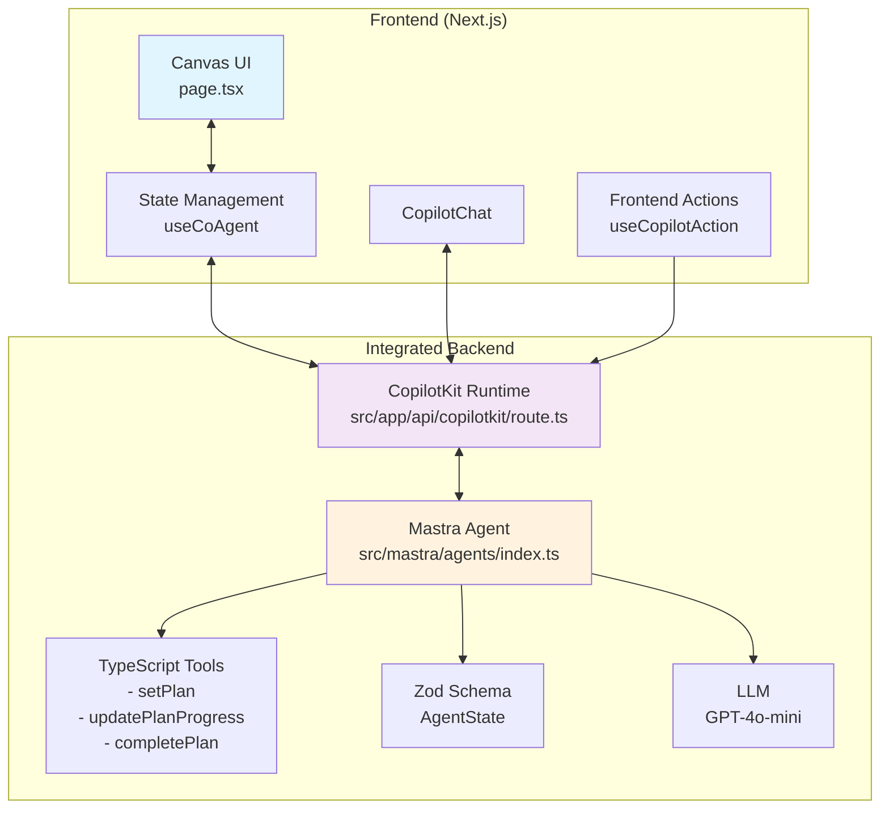
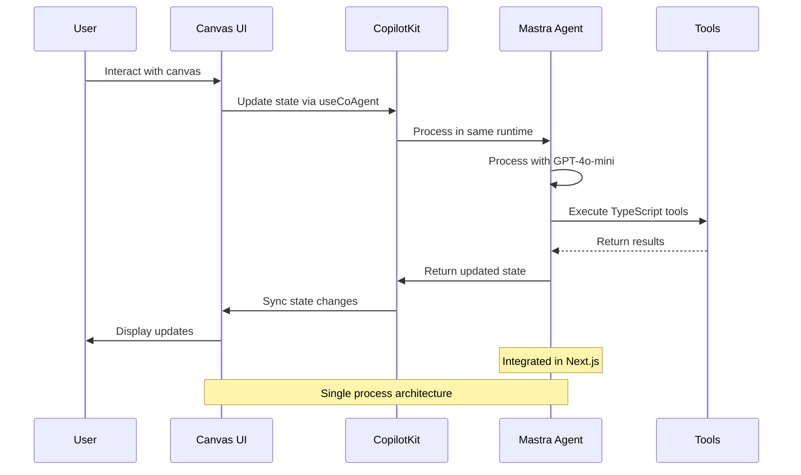

# CopilotKit <> Mastra AG-UI Canvas Starter

This is a starter template for building AI-powered canvas applications using [Mastra](https://mastra.ai) and [CopilotKit](https://copilotkit.ai). It provides a modern Next.js application with an integrated Mastra agent that manages a visual canvas of interactive cards with real-time AI synchronization.

<div align="center">
  
  [](https://www.youtube.com/watch?v=SyAVurXABYg)
  
  Watch the walkthrough video, click the image ⬆️
  
</div>


## ✨ Key Features

- **Visual Canvas Interface**: Drag-free canvas displaying cards in a responsive grid layout
- **Four Card Types**: 
  - **Project**: Includes text fields, dropdown, date picker, and checklist
  - **Entity**: Features text fields, dropdown, and multi-select tags
  - **Note**: Simple rich text content area
  - **Chart**: Visual metrics with percentage-based bar charts
- **Real-time AI Sync**: Bidirectional synchronization between the AI agent and UI canvas
- **Multi-step Planning**: AI can create and execute plans with visual progress tracking
- **Human-in-the-Loop (HITL)**: Intelligent interrupts for clarification when needed
- **JSON View**: Toggle between visual canvas and raw JSON state
- **Responsive Design**: Optimized for both desktop (sidebar chat) and mobile (pop-up chat)
- **Mastra Integration**: Built on Mastra's powerful agent framework with memory management


## 📌 Prerequisites

- Node.js 18+ 
- Any of the following package managers:
  - pnpm (recommended)
  - npm
  - yarn
  - bun

> **Note:** This repository ignores lock files (package-lock.json, yarn.lock, pnpm-lock.yaml, bun.lock) to avoid conflicts between different package managers. Each developer should generate their own lock file using their preferred package manager. After that, make sure to delete it from the .gitignore.

## ✈️ Getting Started

1. Add your OpenAI API key
```bash
# You can use whatever model Mastra supports
echo "OPENAI_API_KEY=your-key-here" >> .env
```

2. Install dependencies using your preferred package manager:
```bash
# Using pnpm (recommended)
pnpm install

# Using npm
npm install

# Using yarn
yarn install

# Using bun
bun install
```

2. Start the development server:
```bash
# Using pnpm
pnpm dev

# Using npm
npm run dev

# Using yarn
yarn dev

# Using bun
bun run dev
```

This will start both the UI and agent servers concurrently.

## 🖼️ Getting Started with the Canvas

Once the application is running, you can:

1. **Create Cards**: Use the "New Item" button or ask the AI to create cards
   - "Create a new project"
   - "Add an entity and a note"
   - "Create a chart with sample metrics"

2. **Edit Cards**: Click on any field to edit directly, or ask the AI
   - "Set the project field1 to 'Q1 Planning'"
   - "Add a checklist item 'Review budget'"
   - "Update the chart metrics"

3. **Execute Plans**: Give the AI multi-step instructions
   - "Create 3 projects with different priorities and add 2 checklist items to each"
   - The AI will create a plan and execute it step by step with visual progress

4. **View JSON**: Toggle between visual canvas and JSON view using the button at the bottom

## Available Scripts
The following scripts can also be run using your preferred package manager:
- `dev` - Starts both UI and Mastra agent in development mode
- `dev:agent` - Starts only the Mastra agent development server
- `dev:debug` - Starts both with debug logging enabled (LOG_LEVEL=debug)
- `build` - Builds the application for production
- `start` - Starts the production server
- `lint` - Runs ESLint for code linting

## 🏛️ Architecture Overview



### Frontend (Next.js + CopilotKit)
The main UI component is in [`src/app/page.tsx`](https://github.com/CopilotKit/canvas-with-mastra/blob/main/src/app/page.tsx). It includes:
- **Canvas Management**: Visual grid of cards with create, read, update, delete operations
- **State Synchronization**: Uses `useCoAgent` hook for real-time state sync with the agent
- **Frontend Actions**: Exposed as tools to the AI agent via `useCopilotAction`
- **Plan Visualization**: Shows multi-step plan execution with progress indicators
- **HITL Interrupts**: Uses `useLangGraphInterrupt` for disambiguation prompts

### Backend (Mastra Agent)
The agent logic is in [`src/mastra/agents/index.ts`](https://github.com/CopilotKit/canvas-with-mastra/blob/main/src/mastra/agents/index.ts). It features:
- **State Management**: Zod schema matching the frontend `AgentState`
- **Memory Configuration**: Disabled working memory to prevent stale cached state
- **Tool Integration**: Planning tools (setPlan, updatePlanProgress, completePlan)
- **Model**: Uses OpenAI's GPT-4o-mini by default (configurable)
- **Integrated Agent**: No separate agent process required (runs within Next.js), but can be run separately using `dev:agent`

### Card Field Schema
Each card type has specific fields defined consistently across frontend and agent:
- **Project**: field1 (text), field2 (select), field3 (date), field4 (checklist)
- **Entity**: field1 (text), field2 (select), field3 (tags), field3_options (available tags)
- **Note**: field1 (textarea content)
- **Chart**: field1 (array of metrics with label and value 0-100)

### Data Flow



## 📚 Customization Guide

### Adding New Card Types
1. Define the data schema in [`src/lib/canvas/types.ts`](https://github.com/CopilotKit/canvas-with-mastra/blob/main/src/lib/canvas/types.ts)
2. Add the card type to the `CardType` union
3. Create rendering logic in [`src/components/canvas/CardRenderer.tsx`](https://github.com/CopilotKit/canvas-with-mastra/blob/main/src/components/canvas/CardRenderer.tsx)
4. Update the agent's instructions in [`src/mastra/agents/index.ts`](https://github.com/CopilotKit/canvas-with-mastra/blob/main/src/mastra/agents/index.ts)
5. Add corresponding frontend actions in [`src/app/page.tsx`](https://github.com/CopilotKit/canvas-with-mastra/blob/main/src/app/page.tsx)

### Modifying Existing Cards
- Field definitions are in the agent's instructions
- UI components are in [`CardRenderer.tsx`](https://github.com/CopilotKit/canvas-with-mastra/blob/main/src/components/canvas/CardRenderer.tsx)
- Frontend actions follow the pattern: `set[Type]Field[Number]`

### Configuring the Agent
- Agent definition: [`src/mastra/agents/index.ts`](https://github.com/CopilotKit/canvas-with-mastra/blob/main/src/mastra/agents/index.ts)
- Tools: [`src/mastra/tools/index.ts`](https://github.com/CopilotKit/canvas-with-mastra/blob/main/src/mastra/tools/index.ts)
- Memory settings can be adjusted in the agent configuration
- Model can be changed by updating the `model` property

### Styling
- Global styles: [`src/app/globals.css`](https://github.com/CopilotKit/canvas-with-mastra/blob/main/src/app/globals.css)
- Component styles use Tailwind CSS with shadcn/ui components
- Theme colors can be modified via CSS custom properties

## 📚 Documentation

- [Mastra Documentation](https://mastra.ai/en/docs) - Learn more about Mastra and its features
- [CopilotKit Documentation](https://docs.copilotkit.ai) - Explore CopilotKit's capabilities
- [Next.js Documentation](https://nextjs.org/docs) - Learn about Next.js features and API

## Troubleshooting

### Agent Connection Issues
If you see "I'm having trouble connecting to my tools", make sure:
1. Your OpenAI API key is set correctly in `.env`
2. The agent is properly registered in [`src/mastra/index.ts`](https://github.com/CopilotKit/canvas-with-mastra/blob/main/src/mastra/index.ts)
3. The server started successfully (check terminal output)

### State Synchronization Issues
If the canvas and AI seem out of sync:
1. Check the browser console for errors
2. Ensure all frontend actions are properly registered
3. Verify the agent's memory is configured to avoid caching (working memory disabled)

### Debug Logging
To enable detailed logging:
```bash
npm run dev:debug
```
This sets `LOG_LEVEL=debug` for more verbose output from Mastra.

### Common Issues
- **"Agent not found"**: Check that 'sample_agent' is registered in [`src/mastra/index.ts`](https://github.com/CopilotKit/canvas-with-mastra/blob/main/src/mastra/index.ts)
- **Tool execution errors**: Ensure tool schemas in [`src/mastra/tools/index.ts`](https://github.com/CopilotKit/canvas-with-mastra/blob/main/src/mastra/tools/index.ts) match frontend expectations
- **TypeScript errors**: Run `npm run build` to check for type issues

## Contributing

Feel free to submit issues and enhancement requests! This starter is designed to be easily extensible.

## License

This project is licensed under the MIT License - see the LICENSE file for details.

---

> [!IMPORTANT]
> Some features are still under active development and may not yet work as expected. If you encounter a problem using this template, please [report an issue](https://github.com/CopilotKit/canvas-with-mastra/issues/new/choose) to this repository.
